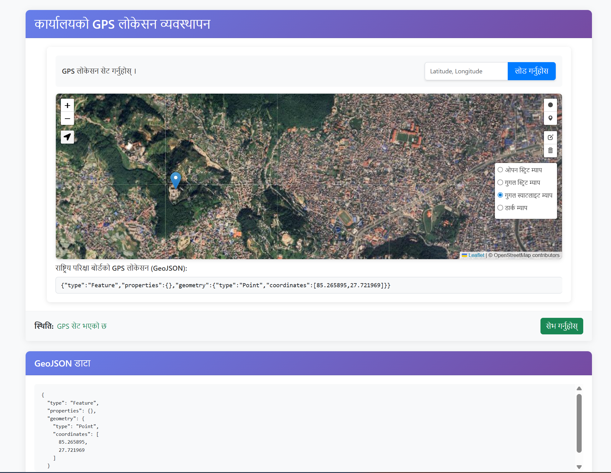

# 📍 Vue 3 Map Application with Leaflet Integration

A reusable **Vue 3 map component** built with **Leaflet.js** for setting GPS locations interactively and storing them in **GeoJSON format**.

---

## ✨ Features

- 🗺️ Interactive map using Leaflet
- 📍 Set GPS location by:
  - Dragging marker
  - Entering Latitude & Longitude manually
- ⭕ Draw marker and circle on map
- 📡 Automatically generates **GeoJSON**
- 🧭 Locate current GPS position
- 🧱 Multiple map layers:
  - OpenStreetMap
  - Google Street
  - Google Satellite
  - Dark Map
- 🔄 Reactive updates with Vue events
- 🌐 Nepali language–friendly UI
- 🧩 Reusable & form-ready component

---

## 🛠️ Tech Stack

- Vue 3 (Composition API)
- Leaflet.js
- Leaflet Draw
- OpenStreetMap

---

## ⚙️ Project Setup

### Install dependencies:

```sh
npm install

### Compile and Hot-Reload for Development

```sh
npm run dev
```

### Compile and Minify for Production

```sh
npm run build
```
## Project Output
